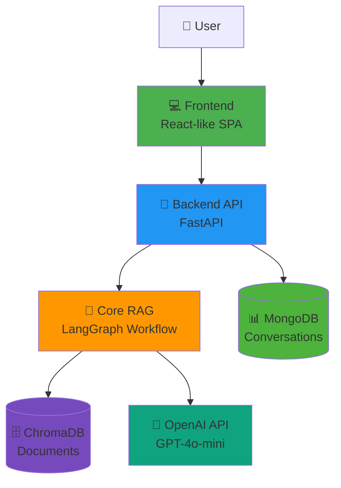
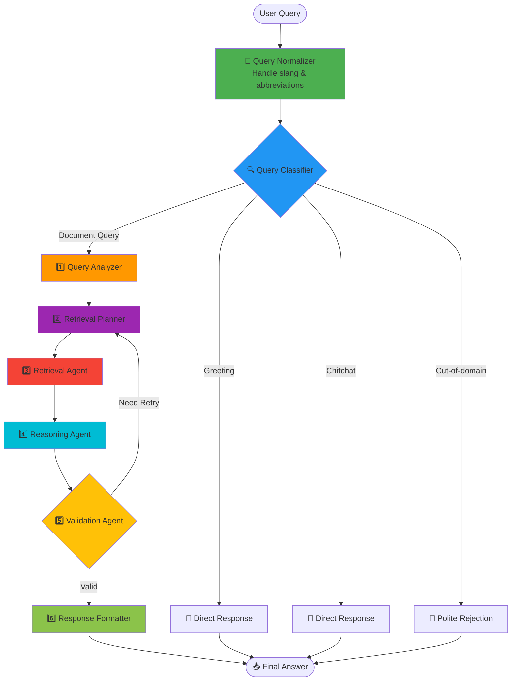
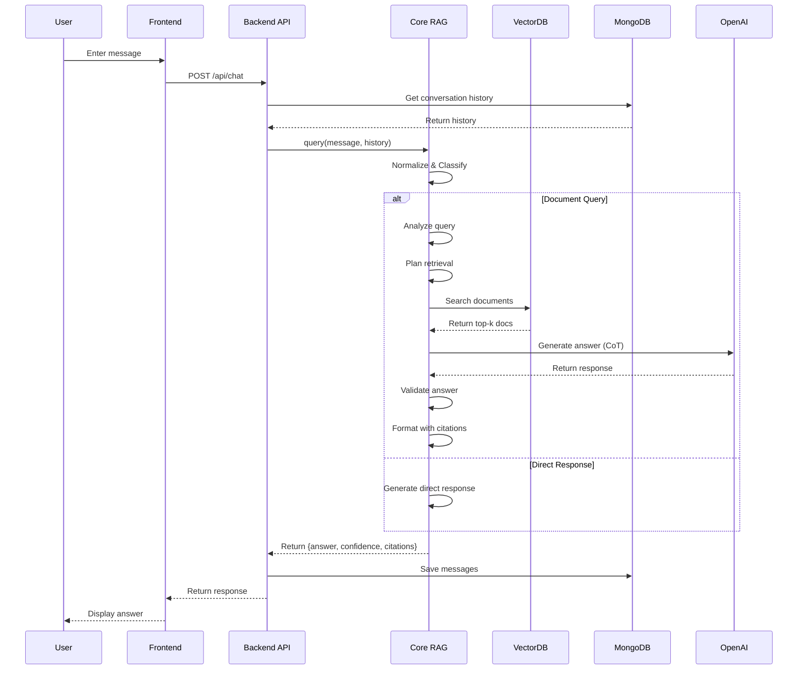

# 🤖 Chatbot System

Hệ thống **Chatbot RAG** (Retrieval-Augmented Generation) thông minh cho tư vấn Quy chế Đào tạo - Đại học Công nghiệp Hà Nội.

## 🌟 Tính năng

### Agentic RAG vs Traditional RAG

**Traditional RAG:**
- ❌ Truy xuất đơn giản, một lần
- ❌ Không phân tích câu hỏi
- ❌ Không có suy luận đa bước
- ❌ Không tự kiểm tra chất lượng

**Agentic RAG (Hệ thống này):**
- ✅ **Phân tích câu hỏi**: Hiểu ý định, độ phức tạp, trích xuất thực thể
- ✅ **Truy xuất thông minh**: Tạo nhiều biến thể câu hỏi, mở rộng truy vấn
- ✅ **Suy luận chuỗi tư duy**: Xử lý từng bước cho câu hỏi phức tạp
- ✅ **Tự phản ánh**: Tự đánh giá và cải thiện câu trả lời
- ✅ **Kiểm tra chất lượng**: Đảm bảo độ tin cậy của câu trả lời
- ✅ **Luồng xử lý LangGraph**: Quản lý các agents thông minh

## 🏗️ Kiến trúc Hệ thống

### Tổng quan Kiến trúc



### Kiến trúc 3 Tầng

#### 1️⃣ **Tầng Giao diện (Frontend)**
```
frontend/
├── index.html      # Giao diện hiện đại glassmorphism
├── styles.css      # Thiết kế responsive
└── app.js          # Quản lý state & API calls
```

**Tính năng:**
- 💬 Giao diện chat thời gian thực
- 📂 Sidebar quản lý cuộc hội thoại với tiêu đề tự động
- ➕ Tạo/xóa cuộc hội thoại
- 🎨 Thiết kế glassmorphism chế độ tối
- 📱 Responsive cho desktop & mobile

#### 2️⃣ **Tầng Ứng dụng (Backend)**
```
backend/
├── app.py         # REST API FastAPI
├── database.py    # Thao tác MongoDB
└── models.py      # Pydantic schemas
```

**Các API Endpoint:**
- `POST /api/chat` - Gửi tin nhắn & nhận phản hồi từ AI
- `GET /api/conversations` - Lấy danh sách tất cả cuộc hội thoại
- `GET /api/conversations/{id}` - Lấy lịch sử cuộc hội thoại cụ thể
- `POST /api/conversations/new` - Tạo cuộc hội thoại mới
- `DELETE /api/conversations/{id}` - Xóa cuộc hội thoại
- `GET /api/health` - Kiểm tra sức khỏe hệ thống
- `GET /api/config` - Lấy cấu hình hệ thống

#### 3️⃣ **Tầng Logic Nghiệp vụ (Core RAG)**
```
core/
├── agentic_rag.py      # Điều phối chính
├── agents.py           # 6 agents chuyên biệt
├── tools.py            # Công cụ cho agents
├── config.py           # Cấu hình hệ thống
└── query_normalizer.py # Xử lý từ lóng/viết tắt
```

### Luồng Xử lý Agentic RAG



### Chi tiết các Thành phần

#### 🎯 Các Agents Chính

| Agent | Trách nhiệm | Công cụ sử dụng |
|-------|-------------|------------------|
| **Query Analyzer** | Phân tích ý định, độ phức tạp, thực thể | QueryAnalysisTool |
| **Retrieval Planner** | Lập kế hoạch truy xuất (đơn/đa truy vấn) | QueryReformulationTool |
| **Retrieval Agent** | Thực thi truy xuất từ vector DB | VectorSearchTool |
| **Reasoning Agent** | Tạo câu trả lời với chuỗi tư duy | InformationExtractionTool |
| **Validation Agent** | Kiểm tra chất lượng & độ tin cậy | ValidationTool |
| **Response Formatter** | Định dạng câu trả lời với trích dẫn | - |

#### 🛠️ Công cụ

```python
# Tìm kiếm Vector
VectorSearchTool
├── similarity_search()      # Tìm kiếm ngữ nghĩa
└── search_with_filter()     # Tìm kiếm có lọc theo metadata

# Xử lý Truy vấn  
QueryReformulationTool
├── reformulate()            # Tạo biến thể câu hỏi
└── expand_query()           # Thêm từ đồng nghĩa & liên quan

# Phân tích
QueryAnalysisTool
└── analyze()                # Trích xuất ý định, thực thể, độ phức tạp

# Kiểm tra
ValidationTool
└── validate()               # Check completeness & accuracy
```

### Data Flow



### Technology Stack

#### Frontend
- **HTML5** - Structure
- **Vanilla CSS** - Styling (glassmorphism design)
- **Vanilla JavaScript** - Logic & API calls
- **Fetch API** - HTTP requests

#### Backend
- **FastAPI** - Modern async web framework
- **Pydantic** - Data validation
- **Uvicorn** - ASGI server
- **Motor** - Async MongoDB driver

#### Core Engine
- **LangChain** - LLM framework
- **LangGraph** - Agent orchestration
- **OpenAI GPT-4o-mini** - Language model
- **ChromaDB** - Vector database
- **Sentence Transformers** - Vietnamese embeddings

#### Database
- **MongoDB Atlas** - Document database (conversations)
- **ChromaDB** - Vector database (document embeddings)

## 🆕 Key Features

### Query Normalization
Hệ thống hiểu được **từ lóng và viết tắt** của sinh viên:
- "sv rớt môn" → "sinh viên điểm f"
- "đktc" → "đăng ký tín chỉ"  
- "ăn điểm" → "học lại"
- 50+ mappings khác

### Query Classification
Phân loại thông minh để tránh tìm kiếm không cần thiết:
- **Greeting**: "Xin chào" → Trả lời thân thiện
- **Chitchat**: "Bạn là ai?" → Giới thiệu vai trò
- **Out-of-domain**: "Phương trình bậc 2?" → Từ chối lịch sự
- **Document-related**: "Điều kiện tốt nghiệp?" → RAG pipeline


## 🚀 Cài đặt

### 1. Cài đặt dependencies

```bash
pip install -r requirements.txt
```

### 2. Cấu hình API Key

Tạo file `.env` với nội dung:

```
OPENAI_API_KEY=your_openai_api_key_here
```

### 3. Tạo Vector Database (nếu chưa có)

Chạy notebook `NCKH2025_2026.ipynb` để:
- Load documents quy chế đào tạo
- Chia nhỏ thành chunks
- Tạo embeddings và lưu vào `vector_db/`

## 💻 Sử dụng

### Khởi động Web Application (Khuyến nghị)

#### Bước 1: Khởi động MongoDB
```bash
# Windows
mongod --dbpath <path_to_data>

# Linux/macOS
sudo systemctl start mongodb
```

#### Bước 2: Khởi động Backend Server
```bash
python backend/app.py
```

Server chạy tại: `http://localhost:8000`  
API Docs: `http://localhost:8000/docs`

#### Bước 3: Khởi động Frontend
```bash
cd frontend
python -m http.server 3000
```

Mở browser tại `http://localhost:3000`

**Tính năng Web App:**
- 💬 Giao diện chat hiện đại với glassmorphism design
- 📂 Sidebar danh sách cuộc hội thoại
- ➕ Tạo cuộc hội thoại mới
- 🤖 Tên hội thoại tự động tạo từ câu hỏi đầu tiên
- 🗑️ Xóa cuộc hội thoại
- 📝 Lịch sử chat lưu trữ trong MongoDB
- 🔄 Conversation memory - AI nhớ ngữ cảnh cuộc hội thoại

> Xem chi tiết setup trong [`WEB_SETUP.md`](WEB_SETUP.md)

### Option 2: Giao diện Gradio (Demo đơn giản)

```bash
python demo.py
```

Mở browser tại `http://localhost:7860`

### Option 3: Python Code

```python
from agentic_rag import AgenticRAG

# Initialize
agentic_rag = AgenticRAG()

# Query
result = agentic_rag.query("Sinh viên bị điểm F phải làm gì?")

print(result["answer"])
print(f"Confidence: {result['confidence']:.2%}")
print(f"Sources: {result['citations']}")
```

## ⚙️ Cấu hình

Chỉnh sửa trong `config.py`:

### Model Configuration
```python
MODEL = "gpt-4o-mini"  # hoặc "gpt-4o", "gpt-4-turbo"
TEMPERATURE = 0.7
MAX_TOKENS = 2000
```

### Agent Configuration
```python
enable_multi_query = True          # Tạo nhiều queries
enable_query_expansion = True      # Mở rộng query
enable_chain_of_thought = True     # Suy luận đa bước
enable_self_reflection = True      # Tự kiểm tra
max_reasoning_steps = 5            # Số bước suy luận tối đa
```

### Retrieval Configuration
```python
top_k = 5                         # Số documents retrieve
similarity_threshold = 0.5        # Ngưỡng similarity
```

## 📊 Workflow Chi tiết

### 1. Query Analysis
- Phân loại intent: query, definition, procedure, comparison
- Trích xuất entities: Điều X, Chương Y
- Đánh giá complexity: simple, medium, complex
- Chia thành sub-questions nếu phức tạp

### 2. Retrieval Planning
- **Simple query**: Single retrieval
- **Medium query**: Multi-query (3 variants)
- **Complex query**: Multi-query + expansion

### 3. Retrieval
- Tìm kiếm với tất cả query variants
- Merge và deduplicate results
- Sắp xếp theo similarity score
- Lấy top K documents

### 4. Reasoning
- **Direct**: Trả lời trực tiếp từ documents
- **Chain-of-Thought**: Chia nhỏ → Trả lời từng phần → Tổng hợp

### 5. Validation
- Kiểm tra completeness
- Kiểm tra accuracy
- Tính confidence score
- Retry nếu không đạt threshold

### 6. Response Formatting
- Thêm citations (Điều, Chương)
- Thêm confidence score
- Warning nếu confidence thấp

## 🔧 Advanced Features

### Custom Tools

Thêm tool mới trong `tools.py`:

```python
class CustomTool:
    def __init__(self, llm):
        self.llm = llm
    
    def process(self, input_data):
        # Your logic here
        return result
```

### Custom Agents

Thêm agent mới trong `agents.py`:

```python
class CustomAgent:
    def __init__(self, llm):
        self.llm = llm
    
    def process(self, state: AgentState) -> AgentState:
        # Update state
        return state
```

Sau đó thêm vào workflow trong `agentic_rag.py`.

## 📈 Performance Tips

1. **Caching**: Bật `enable_caching` trong config
2. **Batch Processing**: Xử lý nhiều queries cùng lúc
3. **Model Selection**: Dùng `gpt-4o-mini` cho speed, `gpt-4o` cho quality
4. **Top K Tuning**: Giảm `top_k` nếu muốn nhanh hơn
5. **Disable Features**: Tắt chain-of-thought hoặc validation cho simple queries

## 🐛 Troubleshooting

### Lỗi: "Vectorstore not found"
→ Chạy notebook để tạo vectorstore trước

### Lỗi: "OpenAI API key not found"
→ Kiểm tra file `.env` có OpenAI API key

### Lỗi: Import errors
→ Cài đặt lại dependencies: `pip install -r requirements.txt`

### Response chậm
→ Giảm `max_reasoning_steps`, tắt `chain_of_thought`

### Confidence score thấp
→ Tăng `top_k`, cải thiện quality của documents trong vectorstore

## 📚 Ví dụ Queries

```python
# Simple query
"Điều kiện tốt nghiệp là gì?"

# Medium query  
"Sinh viên bị điểm F phải làm gì?"

# Complex query
"So sánh quy định về thời gian học tối đa của sinh viên đại học và cao đẳng, và giải thích các trường hợp ngoại lệ"
```

## 🤝 Contributing

Có thể mở rộng hệ thống bằng cách:
1. Thêm tools mới trong `tools.py`
2. Thêm agents mới trong `agents.py`
3. Cải thiện prompts
4. Thêm datasets mới vào vectorstore
5. Tối ưu workflow trong `agentic_rag.py`

## 📝 License

MIT License

## 👥 Authors

Github: https://github.com/CuongLam1206

---

**Note**: Hệ thống này dùng LangGraph để orchestrate agents, cho phép linh hoạt và mở rộng dễ dàng hơn so với traditional RAG chains.
